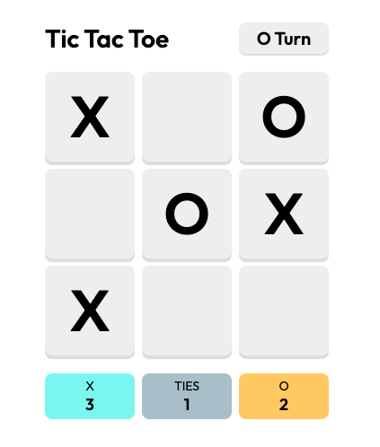

# Tic Tac Toe

This is a [Next.js](https://nextjs.org/) project bootstrapped with [`create-next-app`](https://github.com/vercel/next.js/tree/canary/packages/create-next-app).



## Getting Started

First, install node module:

```bash
yarn
```

Second, run the development server:

```bash
yarn dev
```

## Technical
This project power by NextJS

Project structure
```
├── README.md
├── next.config.js
├── package.json
├── pages
│   ├── _app.js
│   └── index.js
├── public
│   ├── demo.png
│   ├── favicon.ico
│   └── vercel.svg
├── styles
│   └── globals.scss
└── yarn.lock
```


